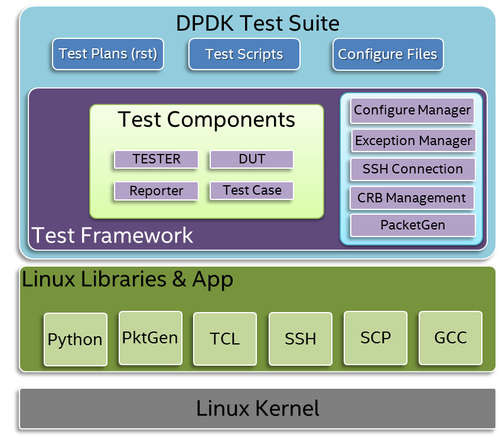
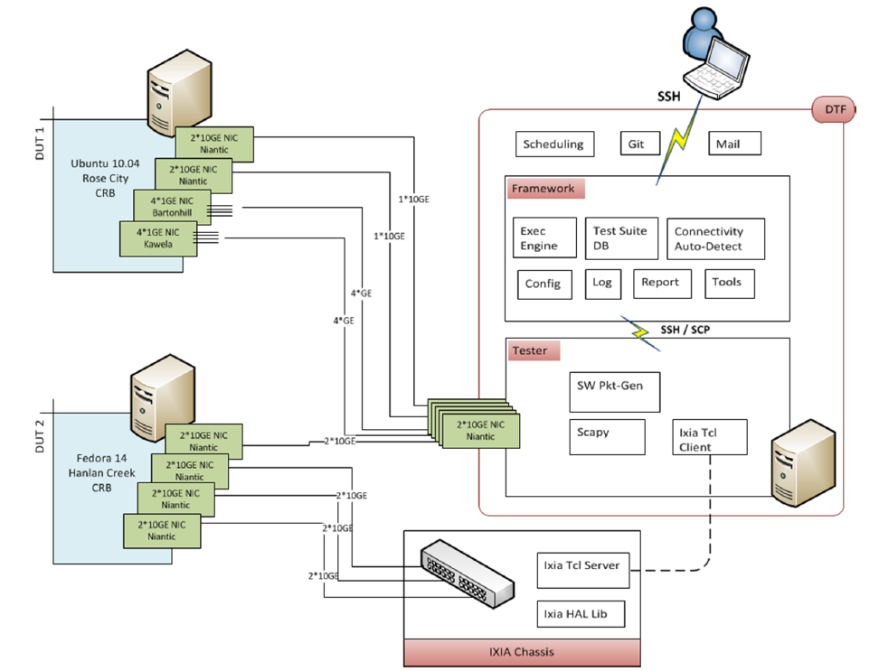

Introduction
============

This document describes how to install and configure the Data Plane Development Kit Test Suite (DPDK Test Suite) in a Linux environment. Users can refer this document to enable this test infrastructure in their environment and don’t need go deeply with too much details about this framework.
DPDK Test Suite is an automation test tool for DPDK software, a python-base library.  It can run on remote tester machine, and communicate/manage DUT by SSH connection. DTF supports different kind of traffic generators, including DPDK-based PacketGen, third-party professional tester equipment (IXIA®).
Data Plane Development Kit Test Suite (DPDK Test Suite)  includes one set of test cases and DPDK generic test framework . DPDK Test Suite provides test example, references and framework for open source community. Based on DPDK Test Suite, everyone can develop their test plan, automation script and configuration for own features and platform. In addition, DPDK Test Suite provides a solution to allow that DPDK developers contribute their function test to certify their patch integration. It only requires limitation effort to maintain test cases once merged into DPDK Test Suite.  Everyone can utilize DPDK Test Suite to measure performance and functionality for features.

Please see DPDK Test Suite architecture in the following figures: 

As generic test framework, DPDK Test Suite provides the following functions:

*   Able to work with DUT (Device Under Test), which installed Fedora, Ubuntu, WindRiver, FreeBSD, RedHat and SUSE
*   Support both software and hardware traffic generators, including Scapy, DPDK-based PacketGen and IXIA traffic generator, even third party packet generator via TCL or Python library.
*   Provide configure files to customize test suite and test cases to run under DUT.
*   Support to output test result by excel, log text file, etc.
*   In addition, Test Framework will manage communication with DUT by SSH, provides library to manage SSH connections.
*   DPDK Test Suite provides one set of basic library to manage tester, DUT, test case, exception, generate report, and configure test plan by user configure files. It’s easy to develop user-defined test suite and test plan by self, and these test cases are able to integrate into DPDK Test Suite.
*   With this test framework, user can automatically identify network topology, and easy to configure/deploy environment for DUT and tester, and provides flexibility to scale test capability by configuration.

DPDK Test Suite environment includes DUT (Device under Test), Tester and packet generator. DPDK software will deployed and run on DUT.  DPDK Test Suite test Framework and test code will be stored into tester. 

Please see architecture in the following figures:

This architecture provides automatically mechanism to manage tester, DUT and packet generators, and remove dependency between test script and test environment/hardware. It defines one abstraction layer for DPDK Test Suite, and provides extensibility to add more test script.  
In the DPDK Test Suite Test Framework, it provides the following modules to help to manage device, platform, configure and test results.

.. table::

    +-----------------------+--------------------------------------------------------------------------------------------------------------------------------------------------------------+
    | File Name             | Description                                                                                                                                                  |
    +-----------------------+--------------------------------------------------------------------------------------------------------------------------------------------------------------+
    | dts.py                | Main Application for DPDK Test Suite                                                                                                                         |
    +-----------------------+--------------------------------------------------------------------------------------------------------------------------------------------------------------+
    | main.py               | Test script to parse input parameter                                                                                                                         |
    +-----------------------+--------------------------------------------------------------------------------------------------------------------------------------------------------------+
    | dut.py                | Setup device under test including  tool chain, IP address                                                                                                    |
    +-----------------------+--------------------------------------------------------------------------------------------------------------------------------------------------------------+
    | tester.py             | Provide API to setup tester environment including IP, port, etc.                                                                                             |
    +-----------------------+--------------------------------------------------------------------------------------------------------------------------------------------------------------+
    | Exception.py          | Manage User-defined exceptions used across the framework.                                                                                                    |
    +-----------------------+--------------------------------------------------------------------------------------------------------------------------------------------------------------+
    | Test_cases.py         | Provides a base class for creating DPDK Test Suite test cases.                                                                                               |
    +-----------------------+--------------------------------------------------------------------------------------------------------------------------------------------------------------+
    | logger.py             | Deal with different log files to record event or message                                                                                                     |
    +-----------------------+--------------------------------------------------------------------------------------------------------------------------------------------------------------+
    | serializer.py         | Provide wrapper class to manage temporary variables during  execution                                                                                        |
    +-----------------------+--------------------------------------------------------------------------------------------------------------------------------------------------------------+
    | settings.py           | Setting for default network card and its identifiers supported by the framework                                                                              |
    +-----------------------+--------------------------------------------------------------------------------------------------------------------------------------------------------------+
    | ssh_connection.py     | Create session to host, implement send_expect and copy function                                                                                              |
    +-----------------------+--------------------------------------------------------------------------------------------------------------------------------------------------------------+
    | ssh_pexpect.py        | Handle ssh sessions between tester and DUT, Implement send_expect function to send command and get output data, Aslo support transfer files to tester or DUT |
    +-----------------------+--------------------------------------------------------------------------------------------------------------------------------------------------------------+
    | pmd_output.py         | Module for get all statics value by port in testpmd                                                                                                          |
    +-----------------------+--------------------------------------------------------------------------------------------------------------------------------------------------------------+
    | rst.py                | Generate Rst Test Result Report                                                                                                                              |
    +-----------------------+--------------------------------------------------------------------------------------------------------------------------------------------------------------+
    | stats_reporter.py     | Simple text file statistics generator                                                                                                                        |
    +-----------------------+--------------------------------------------------------------------------------------------------------------------------------------------------------------+
    | test_result.py        | Generic result container. Useful to store/retrieve results during a DTF execution                                                                            |
    +-----------------------+--------------------------------------------------------------------------------------------------------------------------------------------------------------+
    | excel_reporter.py     | Excel spreadsheet generator                                                                                                                                  |
    +-----------------------+--------------------------------------------------------------------------------------------------------------------------------------------------------------+
    | plotgraph.py          | Generate graphs for each test suite                                                                                                                          |
    +-----------------------+--------------------------------------------------------------------------------------------------------------------------------------------------------------+
    | plotting.py           | Generate Plots for performance test results                                                                                                                  |
    +-----------------------+--------------------------------------------------------------------------------------------------------------------------------------------------------------+
    | etgen.py              | Software packet generator                                                                                                                                    |
    +-----------------------+--------------------------------------------------------------------------------------------------------------------------------------------------------------+
    | ixia_buffer_parser.py | Helper class that parses a list of files containing IXIA captured frames extracting a sequential number on them                                              |
    +-----------------------+--------------------------------------------------------------------------------------------------------------------------------------------------------------+
    | ixiacfg.py            | IXIA Configuration file                                                                                                                                      |
    +-----------------------+--------------------------------------------------------------------------------------------------------------------------------------------------------------+
    | ixiaDCB.tcl           | Third party Library which provided by IXIA, used to configure IXIA tester                                                                                    |
    +-----------------------+--------------------------------------------------------------------------------------------------------------------------------------------------------------+
    | ixiaPing6.tcl         | Third party Library which provided by IXIA, used to ping IXIA tester                                                                                         |
    +-----------------------+--------------------------------------------------------------------------------------------------------------------------------------------------------------+
    | IxiaWish.tcl          | Third party Library which provided by IXIA, set up TCL environment to use correct multiversion-compatible applications                                       |
    +-----------------------+--------------------------------------------------------------------------------------------------------------------------------------------------------------+
    | texttable.py          | Third party Library , create simple ASCII tables                                                                                                             |
    +-----------------------+--------------------------------------------------------------------------------------------------------------------------------------------------------------+

Beside Framework tool, DPDK Test Suite also defines one set of test cases. It includes basic test suite to verify basic functionality of DPDK library.  These test script provides example and reference. Everyone can develop their test cases, verify their features functionality, and commit generic test report to maintainer.  However, user-defined test cases, plan and script must follow DPDK Test Suite standard including code standard, naming conventions, configure format, rst test plan, API. 

Please see test cases, which included in the DPDK compliance test suites:

.. table::

    +---------------------+--------------------------------------------------------------------------------------------------------------------------------------------------------------------------------------------------------------+
    | Test Suite          | Descriptions                                                                                                                                                                                                 |
    +---------------------+--------------------------------------------------------------------------------------------------------------------------------------------------------------------------------------------------------------+ 
    | Command line        | Define a demo example of command line interface in RTE                                                                                                                                                       |
    +---------------------+--------------------------------------------------------------------------------------------------------------------------------------------------------------------------------------------------------------+
    | hello_world         | Print a ``helloworld`` message on every enabled logic core.                                                                                                                                                  |
    +---------------------+--------------------------------------------------------------------------------------------------------------------------------------------------------------------------------------------------------------+
    | Multi process       | Demonstrates the basics of sharing information between DPDK processes.                                                                                                                                       |
    +---------------------+--------------------------------------------------------------------------------------------------------------------------------------------------------------------------------------------------------------+
    | Timer               | Shows how timer can be used in a RTE application.                                                                                                                                                            |
    +---------------------+--------------------------------------------------------------------------------------------------------------------------------------------------------------------------------------------------------------+
    | Blacklist/WhiteList | Tests Whitelist/Blacklist Features by Poll Mode Drivers.                                                                                                                                                     |
    +---------------------+--------------------------------------------------------------------------------------------------------------------------------------------------------------------------------------------------------------+
    | checksum_offload    | Tests RX/TX L3/L4 Checksum offload features by Poll Mode Drivers                                                                                                                                             |
    +---------------------+--------------------------------------------------------------------------------------------------------------------------------------------------------------------------------------------------------------+
    | jumbo_frame         | Tests jumbo frames features by Poll Mode Drivers                                                                                                                                                             |
    +---------------------+--------------------------------------------------------------------------------------------------------------------------------------------------------------------------------------------------------------+
    | testpmd             | Provides benchmark tests for the Intel Ethernet Controller (Niantic) Poll Mode Driver.                                                                                                                       |
    +---------------------+--------------------------------------------------------------------------------------------------------------------------------------------------------------------------------------------------------------+
    | l2fwd               | Provides a basic packet processing application using DPDK. It is a layer-2 (L2) forwarding application which takes traffic from a single RX port and transmits it with few modification on a single TX port. |
    +---------------------+--------------------------------------------------------------------------------------------------------------------------------------------------------------------------------------------------------------+
    | L3fwd               | Verifies Layer-3 Forwarding results using ``l3fwd`` application.                                                                                                                                             |
    +---------------------+--------------------------------------------------------------------------------------------------------------------------------------------------------------------------------------------------------------+
    | IP fragment         | Verifies IPv4 fragmentation using ``ipv4_frag`` application.                                                                                                                                                 |
    +---------------------+--------------------------------------------------------------------------------------------------------------------------------------------------------------------------------------------------------------+
    | Flow direction      | Verifies  the Flow Director feature of the Intel 82599 10GbE Ethernet Controller                                                                                                                             |
    +---------------------+--------------------------------------------------------------------------------------------------------------------------------------------------------------------------------------------------------------+
    | link_flowctrl       | Verifies  Ethernet Link Flow Control Features by Poll Mode Drivers                                                                                                                                           |
    +---------------------+--------------------------------------------------------------------------------------------------------------------------------------------------------------------------------------------------------------+
    | ieee1588            | Tests the IEEE1588 Precise Time Protocol offload supported in Poll Mode Drivers.                                                                                                                             |
    +---------------------+--------------------------------------------------------------------------------------------------------------------------------------------------------------------------------------------------------------+
