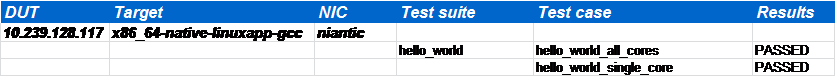

Review Test Result
==================

Browse the result files
-----------------------
After DPDK Test Suite finished the validation, we can find the result files as below in output folder. The files in output folder maybe different when change the CRB or choose different suites.

For Example, You can find the following in output folder after execution.

.. code-block:: console

   [root@tester output]# ls
   CrownPassCRB1  dts.log  statistics.txt  TestHelloWorld.log  test_results.xls

Please see details about these files:

*   CrownPassCRB1: contains the result RST file and graph of performance data
*   dts.log: Full execution log of DPDK Test Suite framework  
*   statstics.txt: summary statistics of DPDK Test Suite executed suites 
*   TestHelloWorld.log: log message of TestHelloWorld case
*   test_result.xls: excel format result file

Check test result of DPDK Test Suite
------------------------------------

You can go through the summary of execution result via statistic.txt. This file includes the number of passed test cases, the number of failed case, the number of blocked and pass ratio. 

Please see example as the following. You can cat the sample file, then show this information of execution, totally executed two test cases, all cases passed the criterion and no failed or blocked cases.

.. code-block:: console

   [root@tester output]# cat statistics.txt
   Passed     = 2
   Failed     = 0
   Blocked    = 0
   Pass rate  = 100.0

If you need more detail information of test result, please open excel formatted file test_result.xls. This file contains of both detailed case information and case results. Also you can find description of the failure reason if DPDK Test Suite can track it.

If you want to track more details about the process of each suite, please go to log file which named by this suite, all related information will stored in this file.

DPDK Test Suite log module provides several levels to track event or output in log file. Every message level will have its own scopes.  Separated log messages will help us get to known what happening in DPDK Test Suite and what happening in DUT and tester.

.. table::

    +---------------------+---------------------------------------------------------------------------------------------+
    | Level               | description                                                                                 |
    +---------------------+---------------------------------------------------------------------------------------------+
    | INFO                | DPDK Test Suite system level log, show start and stop process in this suite                 |
    +---------------------+---------------------------------------------------------------------------------------------+
    | SUITE_DUT_CMD       | Commands send to DUT CRB                                                                    |
    +---------------------+---------------------------------------------------------------------------------------------+
    | SUITE_DUT_OUTPUT    | Output after the send the commands to DUT                                                   |
    +---------------------+---------------------------------------------------------------------------------------------+
    | SUITE_TESTER_CMD    | Commands send to tester, most of they are Scapy commands which will send packet to DUT port |
    +---------------------+---------------------------------------------------------------------------------------------+
    | SUITE_TESTER_OUTPUT | Output after the send the commands to tester                                                |
    +---------------------+---------------------------------------------------------------------------------------------+
    

Please see example for TestHelloWorld suite log as the following. This log file showed that application helloworld sent hello message from core1, and finally matched the pass criterion.

.. code-block:: console

   22/08/2014 11:04:45                 INFO:
   TEST SUITE : TestHelloWorld
   22/08/2014 11:04:45                 INFO: NIC :        niantic
   22/08/2014 11:04:45        SUITE_DUT_CMD: make -j -C examples/helloworld
   22/08/2014 11:04:45     SUITE_DUT_OUTPUT: make: Entering directory `/root/dpdk/examples/helloworld'^M
     CC main.o^M
     LD helloworld^M
     INSTALL-MAP helloworld.map^M
     INSTALL-APP helloworld^M
   make: Leaving directory `/root/dpdk/examples/helloworld'
   22/08/2014 11:04:45                 INFO: Test Case test_hello_world_single_core Begin
   22/08/2014 11:04:45        SUITE_DUT_CMD: ./examples/helloworld/build/app/helloworld -n 1 -c 0x1fffffffff
   22/08/2014 11:04:48     SUITE_DUT_OUTPUT: EAL: Detected lcore 0 as core 0 on socket 0^M
   …
   hello from core 1
   22/08/2014 11:05:08                 INFO: Test Case test_hello_world_single_core Result PASSED:
   22/08/2014 11:05:09        SUITE_DUT_CMD: uname
   22/08/2014 11:05:09     SUITE_DUT_OUTPUT:
   22/08/2014 11:05:09     SUITE_TESTER_CMD: killall scapy 2>/dev/null; echo tester
   22/08/2014 11:05:09  SUITE_TESTER_OUTPUT: tester
   22/08/2014 11:05:10     SUITE_TESTER_CMD: uname
   22/08/2014 11:05:10  SUITE_TESTER_OUTPUT:
   22/08/2014 11:05:10                 INFO:
   TEST SUITE ENDED: TestHelloWorld

Generate PDF doc from RST
-------------------------

Since DPDK Test Suite stores test result as RST by default, you may be want to transfer it to PDF formatted which make it more readable. Firstly, please enter the folder which contained the RST results, then use python tool ``rst2pdf`` to convert RST. If there’s no error return, you can find the pdf file generated with same name.

.. code-block:: console

   [root@tester dcts]# cd output/CrownPassCRB1/x86_64-native-linuxapp-gcc/Niantic
   [root@tester niantic]# rst2pdf TestResult_hello_world.rst
   [root@tester niantic]# ls
    TestResult_hello_world.pdf  TestResult_hello_world.rst

