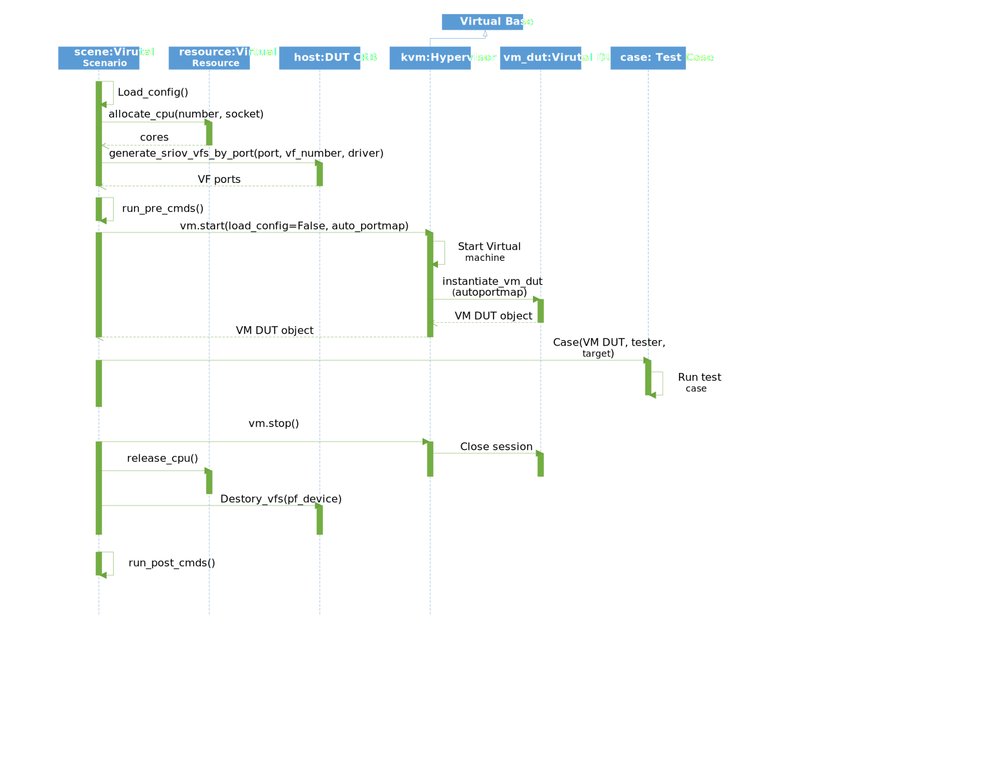

Virtualization Framework
========================

Design Concept
--------------
DTS virtualization framework is based on extendible design which can support different types of hypervisors and their parameters. 

Suite for virtual feature should handle virtual machine creation and destruction. It only need to execute some most basic operations on guest like start, stop. There're two ways to configure virtual machine. One is configuration file, the other one is to call hypervisor internal API. Suite can choose anyway of them based on its implementation.

.. note::
	If VM configurations are different between test cases, those configurations shared with all cases should be defined in suite local configuration file. Those dynamical configurations should be set by hypervisor module's API.

Virtual machine DUT class is inherited from host DUT class. This mean that for vm DUT, can call the same API as DUT object.

Flow Chart
~~~~~~~~~~

Below picture show the virtualization related modules working flow. 

System Requirements
-------------------

Host Preparation
~~~~~~~~~~~~~~~~

Kernel should enable KVM. In bios feature Intel(R) Virtualization Technology should be enabled. Emulator qemu must be installed in host.

.. note::
	Some features like virtio cuse request higher version than default qemu release with linux distribution. For those features, qemu should be updated to version later than 2.1.

Guest Preparation
~~~~~~~~~~~~~~~~~

SSH connection
""""""""""""""

DTS create ssh connection to guest based on redirect guest ssh port to host port. Ssh connection will require one interface in guest which can connect to host. User should setup one default interface (e1000) in guest and make sure it can be up after guest boot up. 

.. note::
	Qemu process contained with one virtual DHCP server on 10.0.2.2 and will be allocated an address starting from 10.0.2.15. For more information about qemu network, please reference to https://en.wikibooks.org/wiki/QEMU/Networking.

In qemu module, the default e1000 device's pci address is assigned to 00:1f.0 which is the very end of guest pci address. In guest, we configure udev rule and assign the default interface named as "host_connect".

Add udev rule for default e1000 device:

.. code-block:: console

    vim /etc/udev/rules.d/70-persistent-net.rules
    KERNELS=="0000:00:1f.0",SUBSYSTEMS=="pci", ACTION=="add", DRIVERS=="?*" ,KERNEL=="eth*", NAME="host_connect"

Enable dhcp on default host_connect interface.

.. code-block:: console

    vim /etc/sysconfig/network-scripts/ifcfg-host_connect
    	TYPE="Ethernet"
    	BOOTPROTO="dhcp"
    	DEFROUTE="yes"
    	DEVICE="host_connect"
    	NAME="host_connect"
    	ONBOOT="yes"
    	PEERDNS="yes"
    	PEERROUTES="yes"
    	IPV6_PEERDNS="yes"
    	IPV6_PEERROUTES="yes"

.. code-block:: console

    chkconfig --level 2345 network on

Install qemu guest agent for DTS monitor guest os.

.. code-block:: console

    yum install qemu-guest-agent.x86_64

For network access, should disable guest firewall service.

.. code-block:: console

    systemctl disable firewalld.service

Suite Programing
----------------

Add Configuration File
~~~~~~~~~~~~~~~~~~~~~~

Configuration file should be placed in conf/{suite_name}.cfg and in test suite this file will be loaded for VM configurations. Below is one sample for virtualization suite configuration file.

The section name between [] is the VM name. Here we changed default cpu, mem, disk configurations. And add two local configurations login and vnc into configuration file. 
For cpu parameter, we changed core number to 2 and pin these two cores to socket 1 cores for performance concern. For mem parameter, we changed guest using with hugepage backend memory. It also concerned about performance. For disk parameter, we should change it local disk image absolute path.

Login parameter should be added when guest login username and password not same as host. VNC parameter should be added when need debug guest with vnc display. 

.. code-block:: console

    # vm configuration for vhost sample case
    [vm0]
    cpu =
       model=host,number=2,cpupin=24 25;
    mem =
        size=4096,hugepage=yes;
    disk =
        file=/home/img/vm0.img;
    login =
        user=root,password=tester;
    vnc =
        displayNum=1;

	
Add Parameters
~~~~~~~~~~~~~~
Below is the brief view of the qemu parameters of vxlan sample virtual machine. These parameters are gathered into one list of python dictionary.

.. code-block:: console

    [{'name': [{'name': 'vm0'}]}, 
    {'enable_kvm': [{'enable': 'yes'}]}, 
    {'qga': [{'enable': 'yes'}]}, 
    {'daemon': [{'enable': 'yes'}]}, 
    {'monitor': [{'path': '/tmp/vm0_monitor.sock'}]},
    {'net': [{'opt_addr': '1f', 'type': 'nic', 'opt_vlan': '0'}, {'type': 'user', 'opt_vlan': '0'}]},
    {'device': [{'opt_mac': '00:00:20:00:00:20', 'opt_path': './vhost-net', 'driver': 'vhost-user'}, {'opt_mac': '00:00:20:00:00:21', 'opt_path': './vhost-net', 'driver': 'vhost-user'}]},
    {'cpu': [{'model': 'host', 'number': '4', 'cpupin': '24 25 26 27'}]},
    {'mem': [{'hugepage': 'yes', 'size': '4096'}]},
    {'disk': [{'file': '/storage/vm-image/vm0.img'}]},
    {'login': [{'password': 'tester', 'user': 'root'}]},
    {'vnc': [{'displayNum': '1'}]}]

In vxlan sample suite, we need to support socket based vhost-user network devices. Qemu command for vhost-user device will like as below. 
	
.. code-block:: console

    -chardev socket,path=/path/to/socket,id=chr0 \
    -netdev type=vhost-user,id=net0,chardev=chr0 \	
    -device virtio-net-pci,netdev=net0,mac=00:00:20:00:00:20

For user configuration, we should only care about socket path and mac address. Configuration of vhost-user device should like below.

.. code-block:: console

    device = 
    	    driver=vhost-user,opt_path=./vhost-net,opt_mac=00:00:20:00:00:20
            driver=vhost-user,opt_path=./vhost-net,opt_mac=00:00:20:00:00:21

Python code should like below, vxlan_sample suite chosen this way.

.. code-block:: console

    vm_params = {}
    vm_params['driver'] = 'vhost-user'
    vm_params['opt_path'] = './vhost-net'
    vm_params['opt_mac'] = "00:00:20:00:00:20"
    self.vm.set_vm_device(**vm_params)
    vm_params['opt_mac'] = "00:00:20:00:00:21"
    self.vm.set_vm_device(**vm_params)

If parameter is device, function add_vm_{device} will be called and device options will passed as arguments. The options will be formatted into python dictionary.

.. code-block:: console

    {'opt_mac': '00:00:20:00:00:20', 'opt_path': './vhost-net', 'driver': 'vhost-user'}
    
    def add_vm_device(self, **options):
        if options['driver'] == 'vhost-user':
            self.__add_vm_virtio_user_pci(**options)
    

In internal add virtio user device function, qemu module will generate chardev, netdev and virtio-net-pci command line in sequence.

.. code-block:: console

    def __add_vm_virtio_user_pci(self, **options):
    if 'opt_path' in options.keys() and options['opt_path']:
    	# add socket char device command line
            dev_boot_line = '-chardev socket'
    	char_id = 'char%d' % self.char_idx
    	dev_boot_line += separator + 'id=%s' % char_id + separator + 'path=%s' % 	options['opt_path']
    	self.char_idx += 1
    	self.__add_boot_line(dev_boot_line)
    
    	# add netdev command line
    	netdev_id = 'netdev%d' % self.netdev_idx
    	self.netdev_idx += 1
    	dev_boot_line = '-netdev type=vhost-user,id=%s,chardev=%s,vhostforce' % 	(netdev_id, char_id)
    	self.__add_boot_line(dev_boot_line)
    	
    	# add virtio-net-pci command line
    	opts = {'opt_netdev': '%s' % netdev_id}
            if 'opt_mac' in options.keys() and \
                options['opt_mac']:
            opts['opt_mac'] = options['opt_mac']
                self.__add_vm_virtio_net_pci(**opts)

			
VM Management
~~~~~~~~~~~~~

Suite should have known that which hypervisor type based on. With virtual machine instance, suite can start, stop and check status of the guest. All infrastructures required have been made up by virtualization module, suite should not handle that.
 
.. note::
	Test case should focus in feature validation. VM management related codes recommended to be placed in set_up_all or set_up functions.

In vxlan sample suite, all test cases request to restart virtual machine. The backend application will be started with different parameters. So VM start up code is placed in set_up function.

.. code-block:: console

    def set_up(self):
        """
        Run before each test case.
        """ 
        tep_cmd = tep_cmd_temp % {
            'COREMASK': self.coremask,
            'CHANNELS': self.dut.get_memory_channels(),
            'VXLAN_PORT': self.vxlan_port, 'NB_DEVS': vm_num * 2,
            'FILTERS': self.OUTER_INNER_VNI, 'TX_CHKS': chksum,
            'ENCAP': encap, 'DECAP': decap}
    	self.prepare_vxlan_sample_env(tep_cmd)

Before VM operations, vxlan sample feature request to start tep_termination application first. To initialized hypervisor kvm instance, there're three parameters required. The first is DUT object, the second is VM name and the third is suite name.

.. code-block:: console

    def prepare_vxlan_sample_env(self, tep_cmd):
        # remove unexpected socke
        self.dut.send_expect("rm -rf vhost-net", "# ")
    
        # start tep_termination first
        self.dut.send_expect(tep_cmd, "VHOST_CONFIG: bind to vhost-net")
    
        # start one vm
        self.vm = QEMUKvm(self.dut, 'vm0', 'vxlan_sample')

Before VM start up, suite still can change VM parameters and in this case suite will add two vhost-user devices.

.. code-block:: console

    # add two virtio user netdevices
    vm_params = {}
    vm_params['driver'] = 'vhost-user'
    vm_params['opt_path'] = './vhost-net'
    vm_params['opt_mac'] = "00:00:20:00:00:20"
    self.vm.set_vm_device(**vm_params)
    vm_params['opt_mac'] = "00:00:20:00:00:21"
    self.vm.set_vm_device(**vm_params)

Add exception handler in VM start, it is critical function and better to handle the exception.

.. code-block:: console

    try:
        self.vm_dut = self.vm.start()
        if self.vm_dut is None:
            raise Exception("Set up VM ENV failed!")
    except Exception as e:
        print dts.RED("Failure for %s" % str(e))

	return True

VM start function will just return VM DUT object and support all DUT APIs.

.. code-block:: console

    def vm_testpmd_start(self, vm_id=0):
        """
        Start testpmd in virtual machine
        """
        if vm_id == 0 and self.vm_dut is not None:
            # start testpmd
            self.vm_dut.send_expect(self.vm_testpmd, "testpmd>", 20)
            # set fwd mac
            self.vm_dut.send_expect("set fwd io", "testpmd>")
            # start tx_first
            self.vm_dut.send_expect("start tx_first", "testpmd>")

When case has been run, need kill guest dpdk application and stop VM. 

.. code-block:: console

    def clear_vxlan_sample_env(self):
        if self.vm_dut:
            self.vm_dut.kill_all()
            time.sleep(1)
    
        if self.vm:
            self.vm.stop()
            self.vm = None

KVM Module
----------

Default Parameters
~~~~~~~~~~~~~~~~~~

Enable KVM
""""""""""

DTS enable KVM full virtualization support as default. This option will significant improve the speed of virtual machine.

Qemu Guest Agent
""""""""""""""""

Qemu monitor supply one method to interact with qemu process. DTS can monitor guest status by command supplied by qemu guest agent. Qemu guest agent is based on virtio-serial devices. 

.. code-block:: console

	-device virtio-serial -device virtserialport,chardev=vm_qga0,name=org.qemu.guest_agent.0 
	-daemonize -monitor unix:/tmp/vm_monitor.sock,server,nowait

Check whether guest os has been started up.

.. code-block:: console

	qemu-ga-client address=/tmp/{vm_name}_qga0.sock ping 120

.. note::	

	We only wait two minutes for guest os start up. For guest os only has few hardware and we has disabled most services, so 2 minutes is enough.
	This command will be return when guest os is ready, so DTS will not wait 2 minutes for each time. 

Check whether guest os default interface has been up.

.. code-block:: console

	qemu-ga-client address=/tmp/{vm_name}_qga0.sock ifconfig
	
DTS will wait for guest os default interface upped and get auto dhcp address. After that DTS can connect to guest by ssh connections. 

.. code-block:: console

	lo:
		 inet 127.0.0.1  netmask 255.0.0.0
			inet6 ::1  prefixlen 128
	host_connect:
			inet 10.0.2.15  netmask 255.255.255.0
			inet6 fe80::200:ff:feb9:fed7  prefixlen 64
			ether 00:00:00:b9:fe:d7

Power down  guest os.

.. code-block:: console

	qemu-ga-client address=/tmp/{vm_name}_qga0.sock powerdown
	
.. note::

	For more information about qemu guest agent, please reference to http://wiki.qemu.org/Features/QAPI/GuestAgent.
	
Qemu Monitor
""""""""""""

After guest started, there's no way to known that host pci devices assigned-into guest.
When assign host pci device into guest, we also add "id" string for this device.

.. code-block:: console

	-device pci-assign,host=07:10.0,id=pt_0
	
With this command, we assign host VF device 07:10.0 into guest and it named as "pt_0". "pt_0" mean it's the first device pass through into guest os.
After guest os started, we use dump pci command and generate guest and host pci mapping by "id".

.. code-block:: console

	Bus  0, device   4, function 0:
		Ethernet controller: PCI device 8086:10ed
		  BAR0: 64 bit memory at 0xfebb0000 [0xfebb3fff].
		  BAR3: 64 bit memory at 0xfebb4000 [0xfebb7fff].
		  id "pt_0"
	Bus  0, device   5, function 0:
		Ethernet controller: PCI device 8086:10ed
		  BAR0: 64 bit memory at 0xfebb8000 [0xfebbbfff].
		  BAR3: 64 bit memory at 0xfebbc000 [0xfebbffff].
		  id "pt_1"

Connection to monitor socket on DUT.

.. code-block:: console

	nc -U /tmp/{vm_name}_monitor.sock

.. note::

    For More detail information about qemu monitor. https://en.wikibooks.org/wiki/QEMU/Monitor#info

Configured Parameters
~~~~~~~~~~~~~~~~~~~~~

Net
"""

Net parameter is used to create one new Network Interface. There're few types of network interface supported by net parameter.

Type supported:
    nic: Network Interface Card
    user: connect the user mode network stack
    tap: connect the host TAP network interface
    bridge: connects a host TAP network interface to a host bridge device 

Each type has different options, detail information shown in below tables.

Options for nic:

.. table::

	+-----------------+----------------------------------+----------------+-----------+
	| Option of nic	  | Description	                     | Default value  | Must have |
	+-----------------+----------------------------------+----------------+-----------+
	| opt_vlan        | vlan of virtual nic	             | 0              | No        |
	+-----------------+----------------------------------+----------------+-----------+
	| opt_macaddr     | If not assgin, nic will generate | N/A            | No        |         
	|                 | random mac	                     | 	              |           |
	+-----------------+----------------------------------+----------------+-----------+
	| opt_model       | model of virutal nic             | e1000	      | No        |
	+-----------------+----------------------------------+----------------+-----------+
	| opt_name        | name be assigned for use in      | N/A            | No        | 
	|                 | monitor command                  |                |           |
	+-----------------+----------------------------------+----------------+-----------+
	| opt_addr        | pci address in virtual machine   | N/A            | No        |
	+-----------------+----------------------------------+----------------+-----------+
	| opt_vectors     | number v of MSI-X vectors        | N/A            | No        |
	+-----------------+----------------------------------+----------------+-----------+

Options for user: 

.. table::

	+-----------------+----------------------------------+----------------+-----------+
	| Option of user  | Description	                     | Default value  | Must have |
	+-----------------+----------------------------------+----------------+-----------+
	| opt_vlan        | vlan of virtual nic	             | 0              | No        |
	+-----------------+----------------------------------+----------------+-----------+
	| opt_hostfwd     | Redirect incoming TCP or UDP     | N/A            | No        |
	|                 | connections to the host port     |                |           |
	+-----------------+----------------------------------+----------------+-----------+

Options for tap: 

.. table::

	+-----------------+----------------------------------+----------------+-----------+
	| Option of tap   | Description	                     | Default value  | Must have |
	+-----------------+----------------------------------+----------------+-----------+
	| opt_vlan        | vlan of virtual nic	             | 0              | No        |
	+-----------------+----------------------------------+----------------+-----------+
	| opt_br          | bridge which tap device bound to | br0            | Yes       |
	+-----------------+----------------------------------+----------------+-----------+
	| opt_script      | script for tap device network    | /etc/qemu-ifup | No        |
	|                 | configure                        |                |           |
	+-----------------+----------------------------------+----------------+-----------+
	| opt_downscript  | script for tap device network    | /etc/          | No        |
	|                 | deconfigure	                     | qemu-ifdown    |           |
	+-----------------+----------------------------------+----------------+-----------+

Device
""""""

Device parameter is used to add one emulated device into guest. Now DTS support few types of driver based devices.

Driver supported:
		pci-assign: pci passthrough host devices into vm
		virtio-net-pci: virtio devices
		vhost-user: vhost-user network device based on socket
		vhost-cuse: vhost-user network device based on tap

Options for pci-assign:

.. table::

	+-----------------+----------------------------------+----------------+-----------+
	| Options of      | Description                      | Default value  | Must have |
	| pci-assign      |                                  |                |           |
	+-----------------+----------------------------------+----------------+-----------+
	| opt_host        | host pci device address          | N/A            | Yes       |
	+-----------------+----------------------------------+----------------+-----------+
	| opt_addr        | pci address in virtual machine   | N/A            | No        |
	+-----------------+----------------------------------+----------------+-----------+

Options for virtio-net-pci:

.. table::

	+-----------------+----------------------------------+----------------+-----------+
	| Option of       | Description	                     | Default value  | Must have |
	| virtio-net-pci  |                                  |                |           |
	+-----------------+----------------------------------+----------------+-----------+
	| opt_netdev      | name for virtio netdev           | N/A            | Yes       |
	+-----------------+----------------------------------+----------------+-----------+
	| opt_id          | netdevice id for virtio          | N/A            | Yes       |
	+-----------------+----------------------------------+----------------+-----------+
	| opt_mac         | mac address on virtio-net device | N/A            | No        |
	+-----------------+----------------------------------+----------------+-----------+
	| opt_bus         | pci bus of virtio-net device in  | N/A            | No        |
	|                 | vm                               |                |           |
	+-----------------+----------------------------------+----------------+-----------+
	| opt_addr        | pci address of virtio-net-pci    | N/A            | Yes       |
	|                 | device in vm                     |                |           |
	+-----------------+----------------------------------+----------------+-----------+

Options for vhost-user:

.. table::

	+-----------------+----------------------------------+----------------+-----------+
	| Option of       | Description	                     | Default value  | Must have |
	| vhost-user      |                                  |                |           |
	+-----------------+----------------------------------+----------------+-----------+
	| opt_path        | unix socket path of character    | N/A            | Yes       |
	|                 | device                           |                |           |
	+-----------------+----------------------------------+----------------+-----------+
	| opt_mac         | mac address on virtio-net-pci    | N/A            | Yes       |
	|                 | device                           |                |           |
	+-----------------+----------------------------------+----------------+-----------+

Options for vhost-cuse:

.. table::

	+-----------------+----------------------------------+----------------+-----------+
	| Option of       | Description	                     | Default value  | Must have |
	| vhost-cuse      |                                  |                |           |
	+-----------------+----------------------------------+----------------+-----------+
	| opt_mac         | mac address on virtio-net-pci    | N/A            | No        |
	|                 | device                           |                |           |
	+-----------------+----------------------------------+----------------+-----------+
	| opt_settings    | virtio device settings           | N/A            | No        |
	+-----------------+----------------------------------+----------------+-----------+
	
VNC
"""

Vnc parameter is used for add vnc display in qemu process. There's only one option "displayNum" supported by this parameter. This parameter is added for user debug.

.. note::
	Display number should be different between virtual machines.
	
User Command
""""""""""""

User command parameter is used for add one special command for qemu. Some qemu command lines are so unique, there's no value to add certain parameter support for them. Those command lines can be implemented by this parameter. 

Login
"""""

Login parameter is used for specify guest login username and password.
